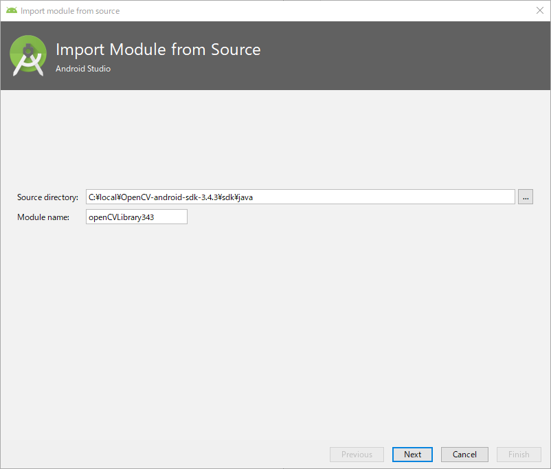
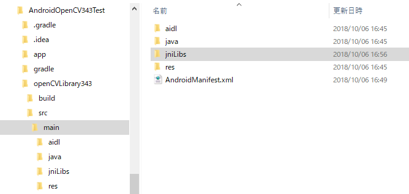

# AndroidOpenCV343Test
Android Studio 3.2でOpenCV 3.4.3を使う手順メモ (*.soをアプリに含めてしまう手順)

## ダウンロード＆解凍
opencv-3.4.3-android-sdk.zipを https://opencv.org/releases.html からダウンロード＆解凍する。
手元では C:\local\OpenCV-android-sdk-3.4.3 に展開したので、以後、ここにOpenCVのファイル一式がある前提で。

## Javaソースコードのインポート
Android Studioで適当に新規にプロジェクトを作成したのち、Android Studioのメニューから File → New → Import Module を選択する。

  - 

C:\local\OpenCV-android-sdk-3.4.3\sdk\java を指定する。

  - 

オプションはそのままでFinishボタンを押す。

  - 

この地点でプロジェクトのディレクトリの中にopenCVLibrary343というディレクトリが作成され、ここにOpenCVがインポートされる。
ただし、この地点では OpenCV\build.gradle のSDKのバージョンが低すぎてエラーが出るので、build.gradleを次のように修正する。

  - 
  - Android StudioにインストールしているSDKのバージョンに合わせて、適切な番号を指定する。例ではAPI Level 23(Android 6)を指定している。

この地点でエラーが出なければ、Javaのソースコードのインポートは完了。

## *.soファイルのインポート
次に、*.soをプロジェクトに取り込み、ビルド済みapkに含める設定を行う。

C:\local\OpenCV-android-sdk-3.4.3\sdk\native\libsディレクトリを丸ごと プロジェクトのディレクトリ\OpenCV\src\main\の中へコピーし、ディレクトリ名をjniLibsに変更しておく。

  - 

すると、Android Studioのプロジェクト"openCVLibrary343"の中にjniLibsが追加される。
この地点でエラーが出なければ、*.soをビルド済みapkに含めるようにする設定は完了。

  - 

## 依存関係の設定
インポートしたoepnCVLibrary343モジュールを利用できるように、アプリケーションのbuild.gradleに次のように設定する。

  - 
  - 古いAndroid Studioでは、compileというキーワードだったけど、最近のAndroid Studioではimplementationという名前に変更されている。

## Activityの実装
次のコードを実行してエラーが出たりアプリが落ちなければ設定完了。

    // MainActivity.java
    package net.sabamiso.android.androidopencv343test;
    
    import android.support.v7.app.AppCompatActivity;
    import android.os.Bundle;
    import android.view.View;
    
    public class MainActivity extends AppCompatActivity {
        static {
            System.loadLibrary("opencv_java3");
        }
    
        OpenCVView view;
    
        @Override
        protected void onCreate(Bundle savedInstanceState) {
            super.onCreate(savedInstanceState);
    
            view = new OpenCVView(this);
            setContentView(view);
        }
    }

    // OpenCVView.java
    package net.sabamiso.android.androidopencv343test;

    import android.content.Context;
    import android.graphics.Bitmap;
    import android.graphics.Canvas;
    import android.graphics.Rect;
    import android.view.View;

    import org.opencv.android.Utils;
    import org.opencv.core.CvType;
    import org.opencv.core.Mat;
    import org.opencv.core.Scalar;
    import org.opencv.core.Size;

    import java.util.Random;

    class OpenCVView extends View {
        Bitmap bmp;
        Mat mat;
    
        public OpenCVView(Context context) {
            super(context);
    
            mat = new Mat();
            mat.create(new Size(640, 480), CvType.CV_8UC3);
    
            byte [] buf = new byte[3];
    
            Random r = new Random();
            for (int y = 0; y < mat.rows(); ++y) {
                for (int x = 0; x < mat.cols(); ++x) {
                    buf[0] = (byte)r.nextInt(255);
                    buf[1] = (byte)r.nextInt(255);
                    buf[2] = (byte)r.nextInt(255);
                    mat.put(y, x, buf);
                }
            }
    
            bmp = Bitmap.createBitmap(mat.cols(), mat.rows(), Bitmap.Config.ARGB_8888);
    
            Utils.matToBitmap(mat, bmp);
        }
    
        @Override
        protected void onDraw(Canvas canvas) {
            super.onDraw(canvas);

            Rect src = new Rect(0, 0,  mat.cols(), mat.cols());
            Rect dst = new Rect(0, 0, getWidth(), getHeight());
            canvas.drawBitmap(bmp, src, dst, null);
        }
    }

## aarファイルの作成
Android Studioのメニューから  View → Gradle を選択して、Gradleビューを開く。

  - 

Gradleビューのツリー表示の中にある openCVLibrary343 → Tasks → build → assembleRelease をダブルクリックして、assembleReleaseタスクを実行する。

  - 

ビルドが完了すると、 openCVLibrary343\build\outputs\aar ディレクトリの中に、openCVLibrary343-release.aarが作成される。

  - 

## Copyright and license
Copyright (c) 2018 yoggy

Released under the [MIT license](LICENSE.txt)
